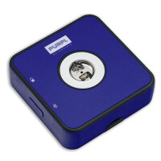
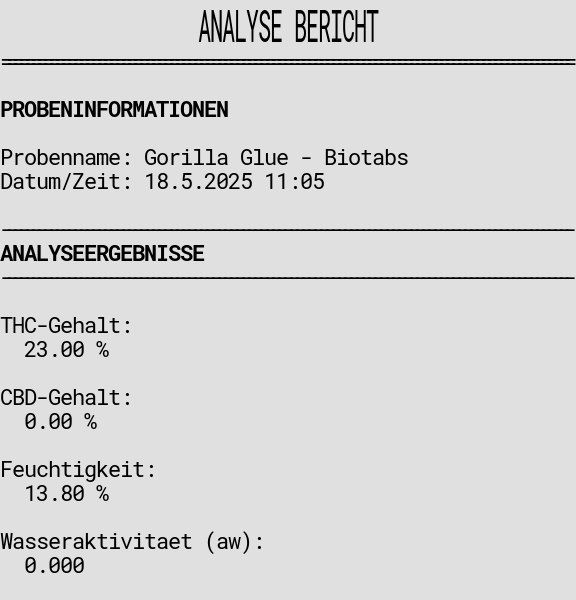

# PurplBot - Purpl Pro Cannabis-Analyse-Bericht-Bot 🧪

Ein spezialisierter Telegram-Bot, der CSV-Dateien von Purpl Pro Cannabis-Analysegeräten verarbeitet und professionelle Berichte mit Thermodruck-Funktionen generiert.



## Über Purpl Pro

Der Purpl Pro ist ein tragbares Cannabis-Analysegerät, das schnelle und genaue Messungen von THC, CBD, Feuchtigkeit und anderen wichtigen Cannabinoid-Werten liefert. Seine mobile App kann CSV-Daten exportieren, die über Telegram geteilt werden können.

## Funktionen

- 📁 **ZIP-Datei-Verarbeitung**: Lade ZIP-Dateien mit CSV-Exporten der Purpl Pro Mobile App hoch
- 📊 **ASCII-Tabellen-Generierung**: Konvertiert Purpl Pro CSV-Daten zu mobil-freundlichen Tabellen
- 📋 **Professionelle Analyseberichte**: Generiert Berichte für THC, CBD, Feuchtigkeit und Wasseraktivität aus Purpl Pro Messungen
- 🖨️ **Thermodrucker-Integration**: Direkter Druck auf EPSON-Thermodrucker
- 📱 **Interaktive Buttons**: Klicke um individuelle Probenberichte zu generieren
- 🔍 **Intelligente Spaltenerkennung**: Erkennt automatisch Name-, THC-, CBD-, Feuchtigkeits- und Zeitstempel-Spalten aus Purpl Pro Exporten

## Voraussetzungen

- Node.js (v14 oder höher)
- npm oder yarn
- Ein Telegram Bot Token (von [@BotFather](https://t.me/botfather))
- Purpl Pro Gerät mit Mobile App für CSV-Export

## Einrichtung

1. **Projekt klonen oder herunterladen**

2. **Abhängigkeiten installieren**
   ```bash
   npm install
   ```

3. **Umgebungsdatei erstellen**
   ```bash
   cp .env.example .env
   ```

4. **Bot-Token konfigurieren**
   - Öffne die `.env` Datei
   - Ersetze `your_telegram_bot_token_here` mit deinem echten Bot-Token
   - Hole dir deinen Bot-Token von [@BotFather](https://t.me/botfather) auf Telegram

5. **Zugangskontrolle konfigurieren**
   - Setze `AUTHORIZED_USERS` auf eine kommagetrennte Liste von autorisierten Telegram-Benutzer-IDs
   - Um eine Benutzer-ID zu erhalten, lass sie eine beliebige Nachricht an den Bot senden (er zeigt ihre ID an, wenn sie nicht autorisiert sind)
   - Leer lassen oder Variable entfernen um allen Benutzern zu erlauben

6. **Thermodrucker konfigurieren (optional)**
   - Setze `THERMAL_PRINTER_IP` auf die IP-Adresse deines Druckers
   - Setze `THERMAL_PRINTER_PORT` auf den Port deines Druckers (normalerweise 9100)
   - Platziere `bonlogo.png` im Projektroot für Logo-Druck

7. **Bot starten**
   ```bash
   # Entwicklungsmodus mit Auto-Neustart
   npm run dev
   
   # Produktionsmodus mit PM2
   npm run pm2:start:prod
   
   # Oder einfacher Produktionsmodus
   npm start
   ```

## Telegram Bot Token erhalten

1. Öffne Telegram und suche nach [@BotFather](https://t.me/botfather)
2. Starte einen Chat und sende `/newbot`
3. Folge den Anweisungen um deinen Bot zu erstellen
4. Kopiere den Bot-Token, der von BotFather bereitgestellt wird
5. Füge ihn in deine `.env` Datei ein

## Verwendung

1. **Starte den Bot** mit dem `/start` Befehl
2. **Exportiere CSV-Daten** aus der Purpl Pro Mobile App
3. **Lade die ZIP-Datei** mit den CSV-Exporten hoch
4. **Erhalte ASCII-Tabellen** für jede CSV-Datei in der ZIP

### Unterstützte Funktionen

- **Dateitypen**: ZIP-Dateien mit CSV-Dateien aus Purpl Pro Mobile App
- **Dateigröße**: Bis zu 20MB (Telegram-Limitation)
- **Mehrere CSVs**: Verarbeite mehrere CSV-Dateien aus einer ZIP
- **Große Tabellen**: Kürzt automatisch große Tabellen für bessere Lesbarkeit

### Befehle

- `/start` - Willkommensnachricht und Anweisungen
- `/help` - Hilfeinformationen anzeigen

## Thermodrucker-Einrichtung

### Unterstützte Drucker
- EPSON-Thermodrucker mit Netzwerkschnittstelle
- Standard-Konfiguration: TCP/IP-Verbindung über Port 9100

### Konfigurationsschritte

1. **Netzwerk-Einrichtung**
   - Verbinde deinen Thermodrucker mit dem Netzwerk
   - Notiere die IP-Adresse des Druckers
   - Stelle sicher, dass Port 9100 erreichbar ist

2. **Umgebungs-Konfiguration**
   ```bash
   # In deiner .env Datei
   THERMAL_PRINTER_IP=10.10.10.24
   THERMAL_PRINTER_PORT=9100
   ```

3. **Optionales Logo**
   - Platziere `bonlogo.png` im Projektroot-Verzeichnis
   - Logo wird oben auf jedem Bericht gedruckt

### Getestete Druckermodelle
- EPSON TM-T20II
- EPSON TM-T82II
- EPSON TM-T88V

### Fehlerbehebung
- Verifiziere Drucker-IP-Adresse und Netzwerkverbindung
- Prüfe dass Port 9100 offen und erreichbar ist
- Stelle sicher dass der Drucker im ESC/POS-Modus ist
- Teste mit `ping <drucker_ip>` und `telnet <drucker_ip> 9100`

## Beispiel

Exportiere CSV-Daten aus der Purpl Pro Mobile App als ZIP-Datei wie:

```
purpl-pro-export.zip
├── probe-001.csv
├── probe-002.csv
└── probe-003.csv
```

Der Bot antwortet mit ASCII-Tabellen für jede CSV:

```
📄 **probe-001.csv**

┌──────────┬──────────┬──────────┬──────────┐
│ Name     │ THC      │ CBD      │ Feuchtig │
├──────────┼──────────┼──────────┼──────────┤
│ Sample A │ 18.5     │ 0.8      │ 12.3     │
│ Sample B │ 22.1     │ 1.2      │ 11.8     │
└──────────┴──────────┴──────────┴──────────┘
```

### Beispiel-Analysebericht

Für Purpl Pro Analysedaten kann der Bot professionelle thermogedruckte Berichte generieren:



Der Bericht enthält:
- Probeninformationen (Name, Datum/Zeit)
- THC-Gehalt in Prozent (Purpl Pro Messung)
- CBD-Gehalt in Prozent (Purpl Pro Messung)
- Feuchtigkeitsgehalt (Purpl Pro Messung)
- Wasseraktivitätswerte (Purpl Pro Messung)

## Konfiguration

### Umgebungsvariablen

- `BOT_TOKEN`: Dein Telegram-Bot-Token (erforderlich)
- `NODE_ENV`: Umgebungsmodus (`development` oder `production`)
- `WEBHOOK_DOMAIN`: Domain für Webhook-Modus (nur Produktion)
- `PORT`: Port für Webhook-Server (Standard: 3000)
- `THERMAL_PRINTER_IP`: IP-Adresse des Thermodruckers (Standard: 192.168.1.100)
- `THERMAL_PRINTER_PORT`: Port des Thermodruckers (Standard: 9100)

### Beschränkungen

- **Zeilenlimit**: Maximum 50 Zeilen pro Tabelle angezeigt
- **Spaltenbreite**: Begrenzt auf 20 Zeichen für mobile Lesbarkeit
- **Dateigröße**: 20MB Maximum (Telegram-Bot-Limitation)
- **Nachrichtenlänge**: Tabellen werden geteilt wenn sie Telegrams 4096-Zeichen-Limit überschreiten

## Produktions-Deployment

Für Produktions-Deployment mit Webhooks:

1. Setze `NODE_ENV=production` in deiner `.env`
2. Setze `WEBHOOK_DOMAIN` auf deine Domain
3. Deploye auf einen Server mit aktiviertem HTTPS
4. Konfiguriere nginx Reverse Proxy (siehe nginx Einrichtung unten)
5. Der Bot wird automatisch den Webhook-Modus verwenden

### Nginx-Einrichtung

Für VPS-Deployment mit nginx:

1. **Nginx-Konfiguration kopieren**:
   ```bash
   sudo cp nginx.conf.example /etc/nginx/sites-available/telegram-csv-bot
   ```

2. **Konfiguration bearbeiten**:
   ```bash
   sudo nano /etc/nginx/sites-available/telegram-csv-bot
   # Ersetze 'your-domain.com' mit deiner echten Domain
   ```

3. **Seite aktivieren**:
   ```bash
   sudo ln -s /etc/nginx/sites-available/telegram-csv-bot /etc/nginx/sites-enabled/
   ```

4. **SSL-Zertifikat erhalten** (mit Let's Encrypt):
   ```bash
   sudo apt install certbot python3-certbot-nginx
   sudo certbot --nginx -d your-domain.com
   ```

5. **Nginx testen und neustarten**:
   ```bash
   sudo nginx -t
   sudo systemctl restart nginx
   ```

### Deployment-Optionen

- **Heroku**: Einfaches Deployment mit automatischem HTTPS
- **Railway**: Einfaches Node.js-Deployment
- **VPS mit Nginx**: Vollständige Kontrolle mit Reverse Proxy (empfohlen)
- **Vercel/Netlify**: Serverless-Deployment (benötigt Webhook-Setup)

## Dateistruktur

```
telegram-csv-bot/
├── bot.js              # Haupt-Bot-Logik
├── package.json        # Abhängigkeiten und Skripte
├── .env.example        # Umgebungsvorlage
├── .env                # Deine Umgebungsvariablen (erstelle diese)
├── README.md           # Diese Datei
└── temp/               # Temporäre Dateien (automatisch erstellt)
```

## Abhängigkeiten

- **telegraf**: Telegram Bot API Framework
- **yauzl**: ZIP-Datei-Extraktion
- **csv-parser**: CSV-Parsing
- **cli-table3**: ASCII-Tabellen-Generierung
- **dotenv**: Umgebungsvariablen-Management

## Fehlerbehandlung

Der Bot behandelt verschiedene Fehlerfälle:

- Ungültige Dateitypen (Nicht-ZIP-Dateien)
- Große Dateien (>20MB)
- Beschädigte ZIP-Dateien
- Leere ZIP-Dateien
- Ungültiges CSV-Format
- Netzwerkfehler

## Mitwirken

Gerne kannst du Issues und Pull Requests einreichen um den Bot zu verbessern!

## Lizenz

MIT Lizenz - verwende diesen Code gerne für deine eigenen Projekte. 